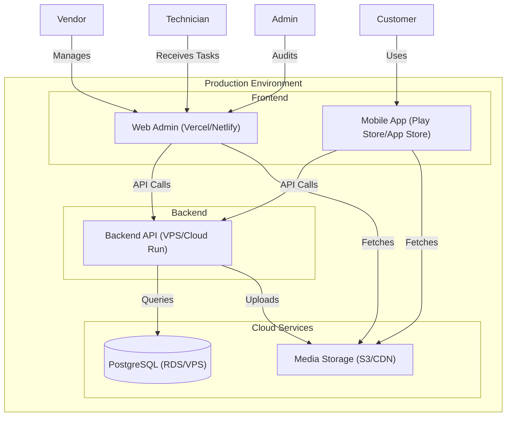

# SolarHub Deployment Architecture

This document describes the codebase structure, repository organization, and live production deployment flow for the SolarHub platform.

## Repository Structure (Monorepo)

We use **npm workspaces** to manage multiple applications and shared packages in a single repository.

```text
solar-hub/
├── apps/
│   ├── backend/          # Node.js Express API
│   ├── mobile/           # React Native / Expo App
│   └── web-admin/        # Next.js / Vite Dashboard (Admin/Vendor/Tech)
├── packages/
│   ├── shared/           # Business logic, constants, validation
│   ├── types/            # TypeScript interfaces and shared types
│   └── ui/               # Shared React components
├── docs/                 # Documentation and architecture
├── package.json          # Root configuration for workspaces
└── ...
```

## Deployment Architecture



## Hosting Strategy

| Layer | Environment | Recommended Provider |
|---|---|---|
| **Backend API** | Node.js Runtime | DigitalOcean VPS / AWS App Runner / GCP Cloud Run |
| **Database** | PostgreSQL | Managed RDS / Supabase / Self-hosted on VPS |
| **Web Admin** | Static / SSR | Vercel / Netlify / Cloudflare Pages |
| **Mobile App** | Android/iOS | Google Play Store / Apple App Store |
| **Media/Assets**| Object Storage | AWS S3 / Cloudflare R2 / DigitalOcean Spaces |

## Production Pipeline

Our release process follows a strict 5-step automated workflow:

1.  **Git Push to Main**: Every merge to `main` triggers the [Production Pipeline](file:///.github/workflows/main.yml).
2.  **CI Builds**: Parallel builds for Backend (Node.js), Web (Vite/React), and Mobile (Expo/React Native).
3.  **Automatic Staging Deployment**: The backend is automatically deployed to the staging environment for verification.
4.  **QA Verification**: Automated [Smoke Tests](file:///apps/backend/tests/qa_smoke_test.js) check payments, orders, and service bookings.
5.  **Phased Release**: 
    - **Internal Testing**: Mobile builds go to Play Store/App Store internal tracks.
    - **Production**: Final manual promotion to live stores after QA approval.


## Mobile Release Strategy (APK Distribution)

We use a dual-channel distribution strategy for the mobile application to maintain a clean separation between Customer and Technician roles.

### Distribution Channels

| User Type | Distribution Method | Access Control |
|---|---|---|
| **Customers** | **Google Play Store / Apple App Store** | Publicly available. Features restricted based on `customer` role. |
| **Technicians** | **Firebase App Distribution / Internal APK** | Private distribution via internal links. Role-based login unlocks the task dashboard. |
| **Vendors** | **Web-only (PWA)** | Encouraged to use the Web Dashboard, but can use the mobile app for basic updates. |

### Build Commands
To generate a production-ready APK/IPA:
```bash
cd apps/mobile
npm run build:apk   # Triggers EAS Cloud Build
npm run build:local # Build locally (requires Android Studio/Xcode)
```

## Distribution Rules

- **Customers**: Get the `mobile` app for browsing, buying, and booking.
- **Vendors**: Use the `web-admin` dashboard for order management and inventory.
- **Technicians**: Use a specialized view in `web-admin` (or the mobile app) for service tasks.
- **Admins**: Private internal access to the `web-admin` panel for audits and system control.

